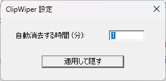

# ClipWiper

ClipWiper は、指定した時間の経過後にクリップボードを自動的にクリアするWindowsデスクトップアプリです。

クリップボードに残ったテキストや画像が何かの拍子にペーストされてしまい、外部に誤送信される事故を防ぎます。

## 機能・特徴

- 指定した間隔で Windows のクリップボードを自動的に消去
- 消去間隔は分単位で設定可能
- 軽量なネイティブ Windows アプリケーション
- C++(ATL)で作成

## 使い方

1. ClipWiper を起動するとタスクバーに常駐します。
2. アイコンをダブルクリックしてクリップボードの消去間隔（分）を設定します。デフォルト設定は5分です。
3. 終了する際はアイコンを右クリックして終了を選択します。
4. アンインストールはプログラムを終了してフォルダごと削除してください。レジストリは使用していません。

## ビルド

### 必要条件

- Windows
- C++ によるデスクトップ開発ワークロードが有効な Visual Studio
- Visual Studio C++ ツールチェーン用の ATL サポートがインストールされていること

### Visual Studio でのビルド手順

1. 本リポジトリをクローンします。
2. Visual Studio で `ClipWiper.slnx` を開きます。
3. `Release` や `x64` など、目的のビルド構成を選択します。
4. プロジェクトをビルドします。

実行可能ファイルは、Visual Studio のビルド出力ディレクトリ内に生成されます。

## ライセンス

MIT License